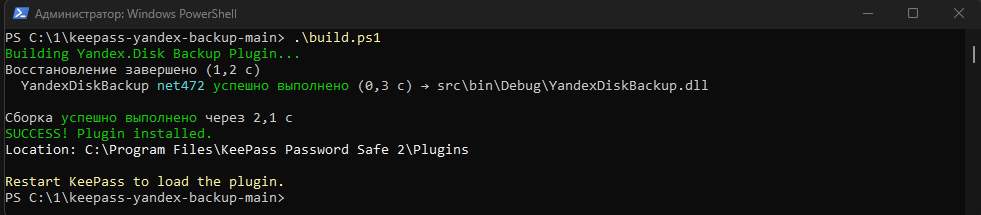
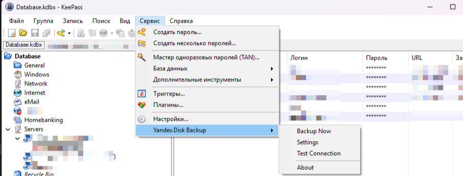
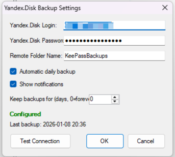
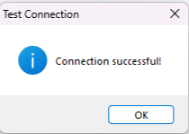
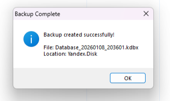

# KeePass Yandex.Disk Backup Plugin


Плагин для автоматического резервного копирования баз данных KeePass на Яндекс.Диск через WebDAV.

## ⚠️ Критически важно!
На данный момент стабильность установки и работы гарантирована только при соблюдении следующего условия: KeePass находится в `C:\Program Files\KeePass Password Safe 2\`

## 📋 Возможности
- ✅ Автоматическое ежедневное резервное копирование
- ✅ Ручное создание бэкапов
- ✅ Настройка срока хранения бэкапов
- ✅ Тестирование соединения с Яндекс.Диском
- ✅ Безопасное хранение учетных данных
- ✅ Уведомления о выполнении операций
- ✅ Поддержка русского и английского интерфейса

## 🚀 Установка
### Способ 1: Готовая сборка (рекомендуется)
1. Скачайте [YandexDiskBackup.dll](https://github.com/Crypto-667/keepass-yandex-backup/releases/latest/download/YandexDiskBackup.dll)
2. Поместите файл в папку плагинов KeePass: `C:\Program Files\KeePass Password Safe 2\Plugins\`
3. Перезапустите KeePass

### Способ 2: Сборка из исходников (Создание файла .dd который вы скачиваете в способе 1)
1. Скачайте [архив репозитория](https://github.com/Crypto-667/keepass-yandex-backup/archive/refs/heads/main.zip) и распакуйте
2. Запустите PowerShell скрипт `build.ps1` для автоматической сборки
3. Плагин автоматически скопируется в каталог программы

Или через командную строку (если установлен git):
```bash
git clone https://github.com/Crypto-667/keepass-yandex-backup.git
cd keepass-yandex-backup
dotnet build --configuration Release
```

## ⚙️ Настройка Яндекс.Диска
### Шаг 1: Включение WebDAV
1. Войдите в [Яндекс.Диск](https://disk.yandex.ru)
2. Перейдите в Настройки → Все настройки → Службы
3. Включите WebDAV
4. Создайте пароль для приложений

### Шаг 2: Настройка плагина в KeePass
1. Откройте KeePass и вашу базу данных
2. Перейдите в Tools → Яндекс.Диск Бэкап → Settings


scr_menu.png
### Шаг 3: Заполнение настроек
| Поле                   | Описание                  | Пример               |
|------------------------|---------------------------|----------------------|
| Yandex.Disk Login      | Ваш email от Яндекс.Диска | user@yandex.ru       |
| Yandex.Disk Password   | Пароль для WebDAV         | (специальный пароль) |
| Remote Folder Name     | Папка на Яндекс.Диске     | KeePassBackups       |
| Automatic daily backup | Ежедневный авто-бэкап     |  Включено            |
| Show notifications     | Показывать уведомления    |  Включено            |
| Keep backups for       | Срок хранения (дней)      | 30  (0 - не удалять) |




### Шаг 4: Тестирование соединения
1. Нажмите Test Connection
2. При успехе: "Connection successful!"
3. При ошибке проверьте: правильность логина/пароля, включен ли WebDAV, интернет-подключение



## 🎯 Использование
### Автоматический бэкап
Плагин автоматически создает бэкап при первом запуске KeePass за день. Время бэкапа = время первого открытия KeePass.

### Ручной бэкап
1. Tools → Яндекс.Диск Бэкап → Backup Now
2. Дождитесь завершения
3. Уведомление об успехе/ошибке


## 🔧 Сборка и разработка
### Требования
- Visual Studio 2022 или VS Code
- .NET Framework 4.7.2 Developer Pack
- KeePass 2.51+

## ❓ Частые проблемы
### Плагин не появляется в меню
1. Проверьте путь установки: `C:\Program Files\KeePass Password Safe 2\Plugins\`
2. Перезапустите KeePass
3. Проверьте наличие плагина в Tools → Plugins

### Ошибка подключения к Яндекс.Диску
1. Убедитесь, что WebDAV включен в настройках Яндекс.Диска
2. Используйте специальный пароль для приложений
3. Проверьте интернет-подключение

## 📄 Лицензия
Распространяется под лицензией MIT. Подробнее в файле [LICENSE](LICENSE).

---
Буду очень рад критике и предложениям.
⭐ Если проект был полезен, поставьте звезду на GitHub!